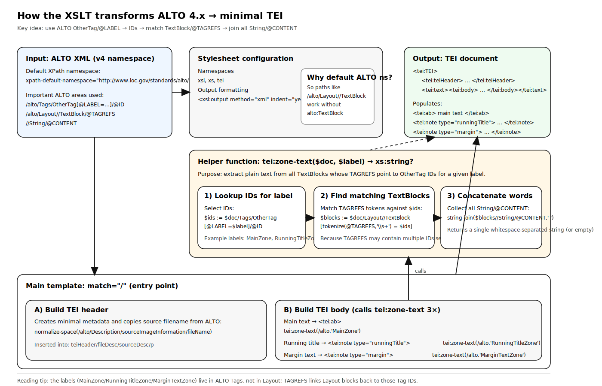
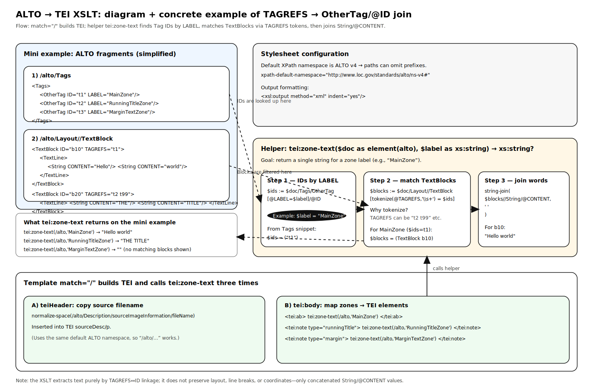

# ALTO to TEI mini transform

Small XSLT 3.0 example that lifts text from an ALTO 4.x file into a minimal TEI document. It concatenates String/@CONTENT from MainZone blocks into one paragraph and collects RunningTitleZone and MarginTextZone into notes.

## Contents
- alto2tei.xsl: stylesheet performing the conversion (uses default ALTO namespace and an XSLT function to gather zone text).
- bpt6k9912811_f13.xml: sample ALTO input.
- output-tei.xml: sample TEI output produced by the PowerShell script.
- xsl-out/result1.xml: sample TEI output produced via the VS Code task.
- test-transform.ps1: helper script to run Saxon HE and check the resulting TEI structure.
- visualisation_overview.svg, visualisation_snippets.svg: diagrams illustrating the transformation and relevant snippets.

## Requirements
- Java runtime (tested with Saxon HE 10.8; adjust the jar path as needed).
- PowerShell (script tested on Windows).

## Run the transform (PowerShell)
```powershell
# Uses defaults defined in the script
./test-transform.ps1

# Override paths or filenames
./test-transform.ps1 -SaxonJar "C:\path\to\saxon-he-10.8.jar" -Source bpt6k9912811_f13.xml -Stylesheet alto2tei.xsl -Output output-tei.xml
```
The script runs Saxon, then asserts that the TEI root exists and that the main paragraph and both notes contain text.

## Run from VS Code
A preconfigured task in `.vscode/tasks.json` targets the XSLT/XPath extension. Trigger the default "Saxon Transform" task, pick an XSLT and XML file when prompted, and the result is written to `xsl-out/result1.xml`.

## Output structure
- TEI header with a minimal file description and the source image filename pulled from the ALTO Description.
- Body containing:
  - `ab`: concatenated MainZone text.
  - `note type="runningTitle"`: RunningTitleZone text.
  - `note type="margin"`: MarginTextZone text.

## Customizing
- Change the zone labels in `alto2tei.xsl` if your ALTO uses different ones.
- Adjust header text or add more TEI metadata as needed.
- Extend the stylesheet with more zones or TEI elements if you need finer granularity.







